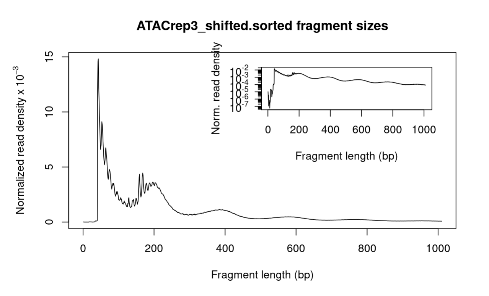
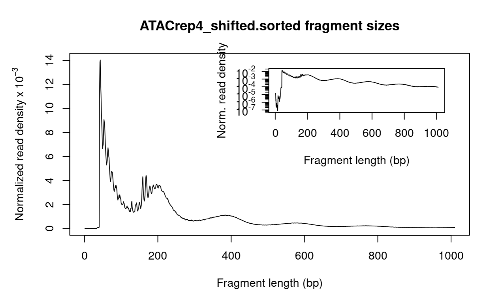
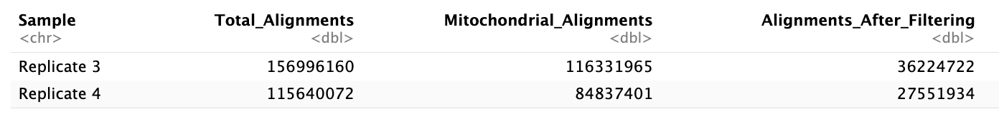
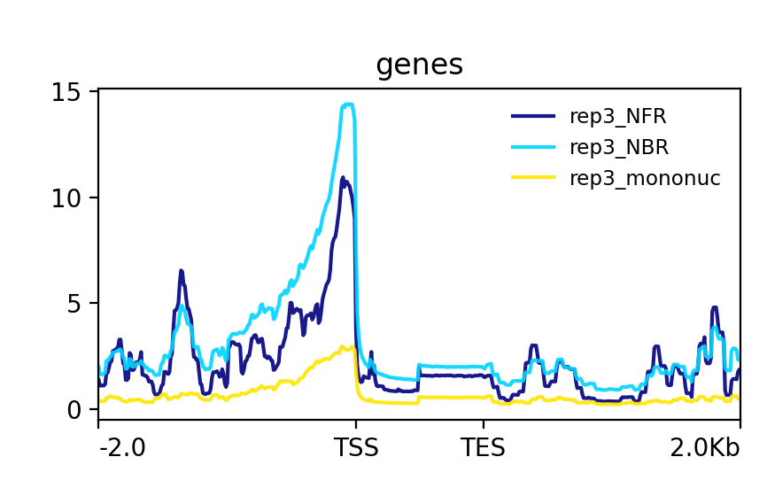
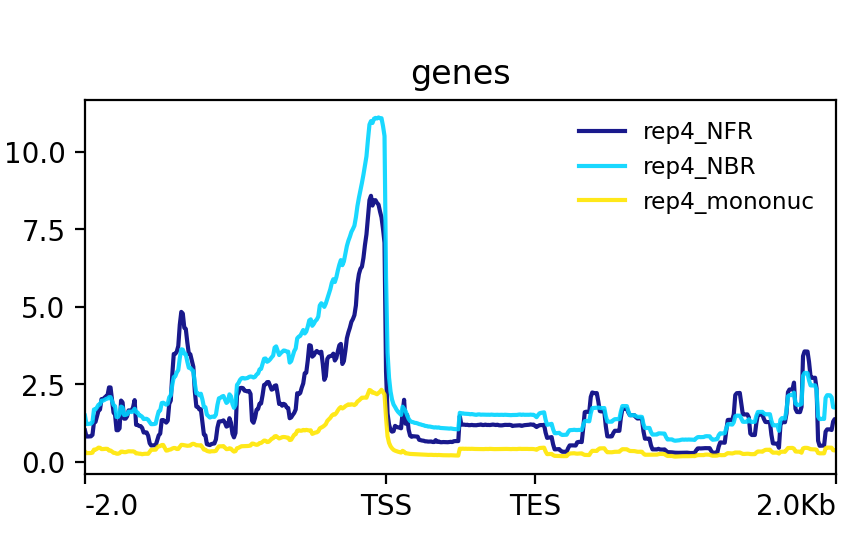
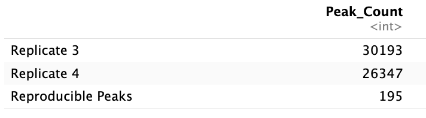
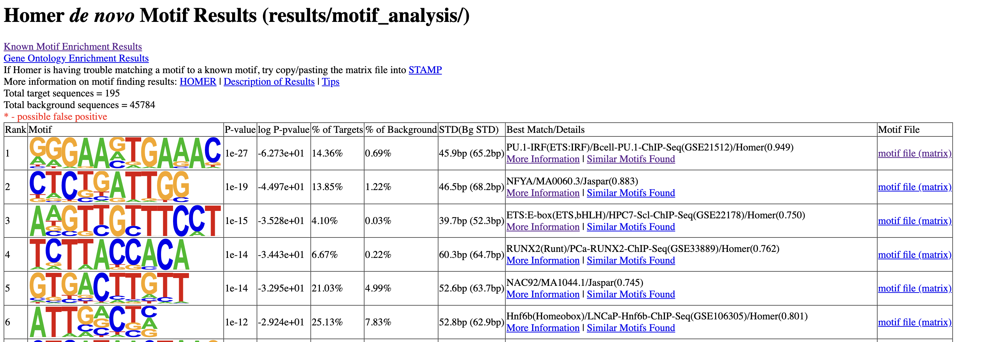
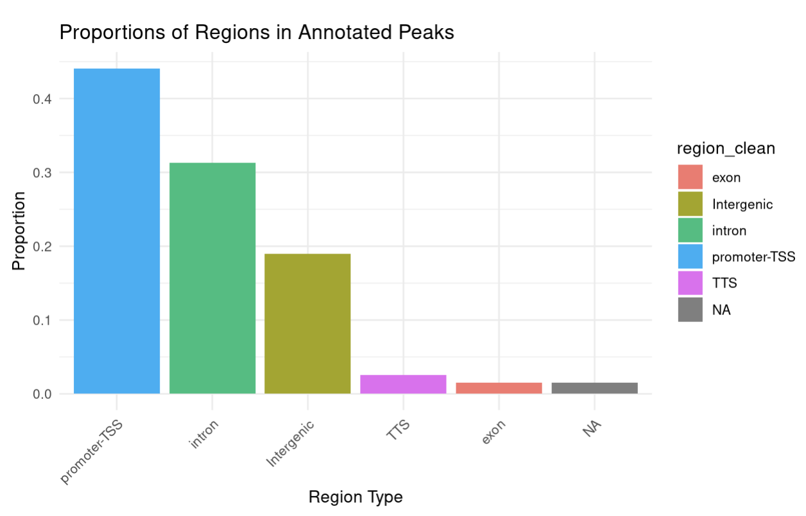

##Final Project Report###

Methods:

```{}
  Quality control checks on the raw sequencing reads were performed using FASTQC v0.11.9 (https://www.bioinformatics.babraham.ac.uk/projects/fastqc/). The resulting HTML files were reviewed to ensure high-quality data.
Adapters were trimmed from the paired-end reads with Trimmomatic v0.39 (Bolger et al., 2014), using the NexteraPE-PE.fa adapter file and generating separate files for both paired and unpaired reads. The Bowtie2 (v2.4.4) index was built from the reference genome (GRCh38.primary_assembly.genome.fa.gz). 
  Trimmed reads were aligned to the indexed reference genome using Bowtie2 v2.4.4 (Langmead & Salzberg, 2012) with a -X 2000 flag to report alignments with a minimum score of 2000. Aligned BAM files were sorted and indexed using Samtools v1.15.1 (Li et al., 2009) with standard parameters, and a flagstat report was generated. Reads mapping to the mitochondrial chromosome (chrM) were filtered out using Samtools view. Reads were shifted using alignmentSieve from deepTools v3.5.1 (Ramirez et al., 2016) with an --ATACshift flag to account for tagmentation bias. Fragment length distribution plots for each sample were created in R using the fragSizeDist function from the ATACseqQC v1.22.0 package(Lun et al., 2014). 
    Peaks were called using MACS3 v2.2.7.1 (Zhang et al., 2008) on the shifted BAM files, generating two bed files for each sample. One reproducible peaks file was generated by intersecting the summits from replicates with BEDTools with -f 0.50 -r flags, specifying that at least 50% overlap was needed for peaks to be considered reproducible. Peaks overlapping regions from the ENCODE blacklist were removed using BEDTools with standard parameters. The remaining peaks were annotated using HOMER's (Heinz et al., 2010) annotatePeaks.pl script, referencing the GENCODE annotation (v45), and -go flag was used to create a separate directory with gene ontology results. Known and de novo motif analysis was conducted using HOMER's findMotifsGenome.pl script. The DeepTools bamCoverage tool was used to generate bigWig files for nucleosome-free regions (NFR), nucleosome-bound regions (NBR), and mononucleosome fractions, with parameters specifying  fragment lengths for each region. The coverage signals from NFR, NBR, and mononucleosome bigWig files were summarized into a matrix using the multiBigwigSummary command from deeptools, and a correlation matrix was plotted. Signal coverage plots for the three regions centered on the TSS were created for each sample using DeepTools computeMatrix and plotProfile tools.
  Further downstream analysis was performed using R v4.2.0. A table was compiled detailing alignments before and after filtering reads mapping to the mitochondrial chromosome. Another table was produced, summarizing the number of peaks called per replicate and the count of reproducible peaks. Gene enrichment analysis on the annotated peaks was conducted by creating a dot plot using the GO results for annotated peaks. The distribution of regions with accessible chromatin (promoter, intergenic, intron, exon, TTS) was visualized in a bar graph.

```


1. Briefly remark on the quality of the sequencing reads and the alignment statistics, make sure to specifically mention the following:
  - Are there any concerning aspects of the quality control of your sequencing reads?
  - Are there any concerning aspects of the quality control related to alignment?
  - Based on all of your quality control, will you exclude any samples from further analysis?

```{}
Based on the flagstats reports, between 94% and 95% of reads mapped to the genonme for all samples, which is high and suggests successful alignment without major concerns.The samples mostly look good based on my FASTQC quality report. I see consistently green quality scores among all bases for all samples, with 0 sequences flagged as poor quality. All samples indicate a failure in sequence duplication levels and per base sequence content; however, it's my understanding that FASTQC failures are not generally cause for concern, as long as the samples are the same. The only difference between samples was that the per tile sequence quality in Rep3_R2 sample was parked as a failure, with minor quality loss in one area, which might potentially indicate an issue with the imaging system. The quality loss is not significant enough to remove the sample, so I would not exclude any samples from further analysis.
```

2. After alignment, quickly calculate how many alignments were generated from each sample in total and how many alignments were against the mitochondrial chromosome
  - Report the total number of alignments per sample
  - Report the number of alignments against the mitochondrial genome

```{}
Total number of alignments:
    - replicate 3: 156996160
    - replicate 4: 115640072

Number of alignments against the mitochondrial chromosome:
    - replicate 3: 116331965
    - replicate 4: 84837401
```

3. After performing peak calling analysis, generating a set of reproducible peaks and filtering peaks from blacklisted regions, please answer the following:
  - How many peaks are present in each of the replicates?
  - How many peaks are present in your set of reproducible peaks? What strategy did you use to determine “reproducible” peaks?
  - How many peaks remain after filtering out peaks overlapping blacklisted regions?

```{}
- 30,193 peaks were present in replicate 3
- 26,347 peaks were present in replicate 4
- 210 peaks were identified in my set of reproducible peaks. 
    - By using the bedtools intersect command with the -f 0.50 and -r options, I made sure that peaks that overlapped by at least 50%            between the two replicates were considered reproducible.
- 195 reproducible peaks remained after filtering out blacklisted regions.
```

4. After performing motif analysis and gene enrichment on the peak annotations, please answer the following:
  - Briefly discuss the main results of both of these analyses
  - What can chromatin accessibility let us infer biologically?

```
Based on my GO analysis, the most significant term was Dutertre Estradiol Response (DUTERTRE_ESTRADIOL_RESPONSE_24HR_DN), where genes like MSRB3 and KYNU are responsive to estradiol, which might hint at hormone response or regulation. Second most significant was phospholipid binding, which plays an essential role in membrane dynamics and signaling pathways. MLL Signature (MULLIGHAN_MLL_SIGNATURE_1_UP) was highly significant as well, with genes like RECK and RASSF7 being linked with an MLL signature, suggesting possible involvement in leukemia or other blood disorders. It would be helpful to know more sdetails about the samples to be able to draw more accurate conclusions about these findings.

My motif analysis uncovered 85 known motifs and 29 de novo motifs, 6 of which were without the risk of false positives. The first and second known motifs (IRF8(IRF) and PU.1:IRF8(ETS:IRF)) indicated significant enrichment of the IRF8 binding motif. IRF8 is a transcription factor that plays an important role in immune cell development and function. This suggests that the samples could have regulatory elements involved in immune responses. The most significant de novo motif identified was PU.1-IRF (ETS:IRF), which also suggests involvement in regulating immune cell function, especially in B cells and myeloid cells.

Overall, chromatin accessibility reveals regions where transcription factors (TFs) and other regulatory proteins can bind, indicating active regulatory regions like promoters and enhancers. By analyzing these accessible regions, specific motifs can be indentified and we can infer which TFs might be binding to these regions to regulate gene expression. It can also help us predict which genes are more likely to be active. Moreover, different cell types have unique patterns of chromatin accessibility, which reflect their specific gene regulation mechanisms, and can help us uncover differences in cell-type specific functions.

```

###Deliverables###

1. Produce a fragment length distribution plot for each of the samples

```{r}


```

2. Produce a table of how many alignments for each sample before and after filtering alignments falling on the mitochondrial chromosome

```{r}

```

3. Create a signal coverage plot centered on the TSS (plotProfile) for the nucleosome-free regions (NFR) and the nucleosome-bound regions (NBR)
  - You may consider fragments (<100bp) to be those from the NFR and the rest as the NBR.
  - You may also wish to separate the fragments into the NFR (<100bp) and the mononucleosome fraction (reads between 180bp and 247bp),         which may make this plot more clear.

```{r}


```


4. A table containing the number of peaks called in each replicate, and the number of reproducible peaks

```{r}

```

5. A single BED file containing the reproducible peaks you determined from the experiment.

```{r}
bed <- as.data.frame(read.table("reproducible_peaks_filtered.bed",header = FALSE, sep="\t",stringsAsFactors=FALSE))
bed

```

6. Perform motif finding on your reproducible peaks
  - Create a single table / figure with the most interesting results

```{}
The image below represents the top most significant de novo motifs without possibility of false positives.
```

```{r}

```

8. Perform a gene enrichment analysis on the annotated peaks using a well-validated gene enrichment tool
  - Create a single table / figure with the most interesting results

```{r}
knitr::include_graphics("go_plot.jpeg")
```

9. Produce a figure that displays the proportions of regions that appear to have accessible chromatin called as a peak (Promoter,             Intergenic, Intron, Exon, TTS, etc.)

```{r}

```
